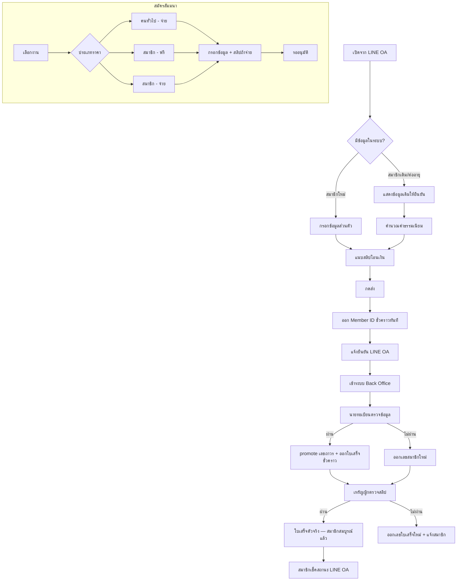

# ตรวจสอบ Flow ระบบ ABTA Phase 1

## สรุปสั้น ๆ

**โครงสร้างใหญ่ที่คุณเข้าใจ — ถูกต้องประมาณ 70–80%**  
แต่ **รายละเอียดการทำงานจริง** ในเอกสารที่ยืนยันแล้ว ([04-Workflows.md](ABTA-System/04-Workflows.md), [02-Phase-1-Confirmed.md](ABTA-System/02-Phase-1-Confirmed.md), [05-Status-and-SLA.md](ABTA-System/05-Status-and-SLA.md)) **ไม่ตรงกับที่คุณอธิบายทุกจุด** โดยเฉพาะเรื่องใบเสร็จ, ID card, การแยกบทบาทเหรัญญิก, และสัมมนา 3 แบบ

---

## Flow ที่คุณอธิบาย vs เอกสารที่ยืนยัน

```mermaid
flowchart TD
    subgraph userFlow [Flow ที่คุณสรุป]
        A1[สมัครสมาชิก] --> A2{มีข้อมูลเดิม?}
        A2 -->|มี| A3[แสดงข้อมูลเดิม]
        A2 -->|ไม่มี| A4[กรอกข้อมูล + สลิป]
        A3 --> A5[ออกเลขสมาชิกชั่วคราวทันที]
        A4 --> A5
        A5 --> A6[แอดมินตรวจข้อมูล]
        A6 -->|ผ่าน| A7[promote เลขถาวร + ออกใบเสร็จชั่วคราว]
        A6 -->|ไม่ผ่าน| A8[เปลี่ยนเลขสมาชิก]
        A7 --> A9[เหรัญญิกตรวจสลิป]
        A8 --> A9
        A9 -->|ผ่าน| A10[ใบเสร็จตัวจริง]
        A9 -->|ไม่ผ่าน| A11[เปลี่ยนเลขใบเสร็จ]
    end

    subgraph docFlow [Flow ในเอกสาร Phase 1]
        B1[เปิดฟอร์มสมัคร] --> B2[กรอกข้อมูล + แนบสลิป ขั้นตอนเดียว]
        B2 --> B3[บันทึก DB]
        B3 --> B4[ออก Member ID ชั่วคราวทันที]
        B4 --> B5[แจ้ง LINE OA]
        B5 --> B6[นายทะเบียน/แอดมินตรวจข้อมูล]
        B6 -->|ผ่าน| B6a[promote เลขถาวร + ออกใบเสร็จชั่วคราว]
        B6a --> B6b[เหรัญญิกตรวจสลิป]
        B6b -->|ผ่าน| B7[ใบเสร็จตัวจริง — สมาชิกสมบูรณ์แล้วตั้งแต่ขั้นนายทะเบียน]
        B6 -->|ไม่ผ่าน| B8[แจ้งให้แก้ไข]
    end
```

---

## สิ่งที่ **ถูกต้อง** ตามที่คุยกัน

| หัวข้อ | สถานะ |
|--------|--------|
| สมัครสมาชิก → ระบบเช็คข้อมูลเดิม (เบอร์/LINE ID) แล้วแสดงให้ยืนยัน | ตรง — ใช้กับสมาชิกเดิม/ต่ออายุ ([04-Workflows.md](ABTA-System/04-Workflows.md) บรรทัด 27–35) |
| สมาชิกใหม่กรอกข้อมูล (ชื่อ, email, เบอร์, หน่วยงาน ฯลฯ) | ตรง — [02-Phase-1-Confirmed.md](ABTA-System/02-Phase-1-Confirmed.md) |
| ออก **เลขสมาชิกชั่วคราวทันที** หลังสมัคร | ตรง — SLA ภายใน 5 นาที ([05-Status-and-SLA.md](ABTA-System/05-Status-and-SLA.md)) |
| มีการตรวจสอบหลังบ้านก่อนอนุมัติเป็นสมาชิกสมบูรณ์ | ตรง |
| ถ้าผ่านนายทะเบียน → ได้เลขถาวร (promote จากชั่วคราว) | ตรง — `memberId: ชั่วคราว → ถาวร` ที่ขั้นที่ 1 ([07-Tech-Stack.md](ABTA-System/07-Tech-Stack.md)) |
| ฝั่งสมาชิกอยู่ใน **LINE OA** เป็นหลัก | ตรง — สมัคร, แจ้งเตือน, เช็คสถานะ |
| **Back Office แยก** สำหรับแอดมิน/เจ้าหน้าที่ | ตรง — Web App แยก ([07-Tech-Stack.md](ABTA-System/07-Tech-Stack.md)) |
| มีระบบสมัครสัมมนา + ดึงข้อมูลสมาชิกอัตโนมัติ | ตรง — Phase 1 รวมอยู่แล้ว |

---

## สิ่งที่ **ไม่ตรง** หรือ **ยังไม่ได้ยืนยัน** ในเอกสาร Phase 1

### 1. ลำดับการตรวจ: แอดมิน → เหรัญญิก (แยก 2 ขั้น)

**ที่คุณสรุป:** แอดมินตรวจข้อมูลก่อน → เหรัญญิกตรวจสลิปทีหลัง

**เอกสาร Phase 1:** มีแค่ **แอดมิน + นายทะเบียน** (2 บทบาท) และ **นายทะเบียนตรวจทั้งข้อมูลสมาชิกและสลิปในขั้นเดียวกัน** ([04-Workflows.md](ABTA-System/04-Workflows.md) บรรทัด 84–87)

**บทบาทเหรัญญิก** ถูกระบุว่าเป็น **Phase 2** ([02-Phase-1-Confirmed.md](ABTA-System/02-Phase-1-Confirmed.md) บรรทัด 99, [06-Phase-2-4-Roadmap.md](ABTA-System/06-Phase-2-4-Roadmap.md))

> ถ้า Phase 1 ต้องการแยกขั้นตรวจ 2 คน ตามที่คุณอธิบาย — **ต้องอัปเดตขอบเขตงาน** เพราะตอนนี้เอกสารยังไม่ได้สัญญาไว้

---

### 2. ใบเสร็จชั่วคราว → ใบเสร็จจริง + เปลี่ยนเลขใบเสร็จ

**ที่คุณสรุป (อัปเดต 12 ก.ค. 2569):**
- ออก Member ID ชั่วคราวทันทีหลังสมัคร
- นายทะเบียนอนุมัติข้อมูลแล้ว → ออกใบเสร็จชั่วคราว
- เหรัญญิกผ่าน → เปลี่ยนเป็นตัวจริง
- ไม่ผ่าน → เปลี่ยนเลขใบเสร็จ

**เอกสาร Phase 1:**
- หลังสมัครได้ **"หลักฐานการรับชำระเงิน"** เมื่อแนบสลิป ([01-Project-Overview.md](ABTA-System/01-Project-Overview.md)) — ไม่ได้ระบุว่าเป็นใบเสร็จชั่วคราว/จริง
- สถานะการชำระเงิน: `รอชำระ → ได้รับสลิป → ตรวจสอบ → ยืนยัน → ออกใบเสร็จแล้ว` ([05-Status-and-SLA.md](ABTA-System/05-Status-and-SLA.md))
- **สร้าง PDF ใบรับเงินชั่วคราว/ใบเสร็จอัตโนมัติ = Phase 2** ([02-Phase-1-Confirmed.md](ABTA-System/02-Phase-1-Confirmed.md) บรรทัด 146)
- **ไม่มี** logic "เปลี่ยนเลขใบเสร็จเมื่อไม่ผ่าน" ในเอกสารเลย

> Flow ใบเสร็จที่คุณอธิบาย **สมเหตุสมผลทางธุรกิจ** แต่ **ยังไม่ได้อยู่ในสัญญา Phase 1 9,000 บาท** ตามเอกสารปัจจุบัน

---

### 3. ไม่ผ่านแอดมิน → "เปลี่ยนเลขสมาชิก"

**ที่คุณสรุป:** ไม่ผ่าน → เปลี่ยนเลขสมาชิก

**เอกสาร Phase 1:** ไม่ผ่าน → **แจ้งสมาชิกให้แก้ไข** ([04-Workflows.md](ABTA-System/04-Workflows.md) บรรทัด 24) — ไม่ได้ระบุการ regenerate เลขใหม่

> ต้องยืนยันกับลูกค้า: "เปลี่ยนเลข" หมายถึงออกเลขชั่วคราวใหม่ หรือแค่ reject แล้วให้ส่งใหม่?

---

### 4. แสดงผลให้สมาชิก: ID card + ใบเสร็จ

**ที่คุณสรุป:** สมาชิกดู **ID card + ใบเสร็จ**

**เอกสาร Phase 1 (LINE "เช็คสถานะ"):** แสดงเฉพาะ **ข้อความสถานะ** — Member ID, สถานะสมาชิก, สถานะชำระเงิน, สถานะสัมมนา, วันหมดอายุ ([05-Status-and-SLA.md](ABTA-System/05-Status-and-SLA.md) บรรทัด 92–105)

**ดาวน์โหลดเอกสาร (บัตร/ใบเสร็จ)** → **Phase 2 Self-Service** ([06-Phase-2-4-Roadmap.md](ABTA-System/06-Phase-2-4-Roadmap.md))

> ถ้า Phase 1 ต้องการให้สมาชิก **เห็นบัตรสมาชิก + ใบเสร็จจริง ๆ** (ไม่ใช่แค่สถานะ) — **เป็น scope เพิ่ม** จากเอกสารปัจจุบัน

---

### 5. สัมมนา 3 แบบ (คนทั่วไปจ่าย / สมาชิกฟรี / สมาชิกจ่าย)

**ที่คุณสรุป:** 3 รูปแบบราคา

**เอกสาร Phase 1:** มีแค่ "แสดงค่าลงทะเบียน" + อัปโหลดสลิปถ้ายังไม่ชำระ — **ไม่ได้ระบุ 3 tier นี้เลย**

> Requirement นี้ **สมเหตุสมผลและควรมี** แต่ต้อง **เพิ่มใน spec** — เช่น field `pricingType: public | member_free | member_paid` ต่อ event

---

### 6. "ทุกอย่างอยู่ใน LINE OA"

**ถูกต้องบางส่วน:**
- เช็คสถานะ, แจ้งเตือน, Rich Menu → LINE OA
- ฟอร์มสมัคร/อัปโหลดสลิป → มักเป็น **Web/LIFF เปิดจาก LINE** (ไม่ใช่พิมพ์แชทล้วน ๆ) ตาม architecture ใน [07-Tech-Stack.md](ABTA-System/07-Tech-Stack.md)
- Back Office → **Web แยก** (ถูกต้องตามที่คุณบอก)

---

## Flow ที่แนะนำให้ใช้เป็น "ความจริง Phase 1" (รวมสิ่งที่คุณต้องการ + สิ่งที่เอกสารยืนยันแล้ว)

**หมายเหตุ:** กล่อง `ประเภทราคา 3 แบบ`, `ใบเสร็จชั่วคราว/จริง`, `ID card`, `แยกเหรัญญิก` — **ยังต้องยืนยัน/เพิ่มใน spec Phase 1**

---

## ตารางสรุป: ฟีเจอร์ตาม Flow ของคุณ vs เอกสาร

| ฟีเจอร์ใน Flow ของคุณ | ในเอกสาร Phase 1 | แนะนำ |
|----------------------|------------------|-------|
| เช็คข้อมูลเดิม + แสดงให้ยืนยัน | มี | ทำ Phase 1 |
| กรอกข้อมูล + แนบสลิป (ขั้นตอนเดียว) | มี | ทำ Phase 1 |
| เลขสมาชิกชั่วคราวทันที | มี | ทำ Phase 1 |
| แอดมินตรวจข้อมูล | มี (รวมกับนายทะเบียน) | ทำ Phase 1 |
| เหรัญญิกตรวจสลิปแยก | ไม่มี (Phase 2) | **ยืนยันกับลูกค้า** |
| ใบเสร็จชั่วคราว/จริง + เปลี่ยนเลข | ไม่มี (Phase 2 PDF) | **ยืนยันกับลูกค้า** |
| แสดง ID card + ใบเสร็จ | ไม่มี (Phase 2) | **ยืนยันกับลูกค้า** |
| สัมมนา 3 แบบราคา | ไม่ได้ระบุ | **เพิ่มใน spec Phase 1** |
| LINE OA + Back Office แยก | มี | ทำ Phase 1 |

---

## สิ่งที่ควรทำก่อนเริ่มพัฒนา (แนะนำ)

1. **นัดยืนยันกับคุณต๋อย/ทีม ABTA** เรื่อง 4 จุดที่ gap:
   - แยกขั้นตรวจ แอดมิน vs เหรัญญิก หรือรวมในนายทะเบียนคนเดียว?
   - ใบเสร็จชั่วคราว/จริง — Phase 1 ต้องการ PDF จริงหรือแค่สถานะ + หลักฐาน?
   - สมาชิกดู ID card + ใบเสร็จใน LINE ได้เลยหรือแค่เช็คสถานะ?
   - สัมมนา 3 tier — ยืนยัน logic ราคาและเงื่อนไขฟรี

2. **อัปเดตเอกสาร** [04-Workflows.md](ABTA-System/04-Workflows.md) และ [02-Phase-1-Confirmed.md](ABTA-System/02-Phase-1-Confirmed.md) ให้ตรงกับที่ลูกค้ายืนยัน — ป้องกัน scope creep หรือ miss requirement

3. **ออกแบบ Data Model เพิ่ม** ใน [07-Tech-Stack.md](ABTA-System/07-Tech-Stack.md):
   - `receiptNumber` (temp → official)
   - `receiptStatus`
   - `seminar.pricingType` (public / member_free / member_paid)
   - `memberCardUrl` (ถ้าต้องการแสดง ID card)

---

## คำตอบตรง ๆ ต่อคำถาม "ถูกต้องมั้ย"

| คำถาม | คำตอบ |
|-------|--------|
| Flow สมัคร → เช็คข้อมูล → ออกเลขชั่วคราว → ตรวจหลังบ้าน → อนุมัติ | **ใช่ — ถูกต้องในแนวใหญ่** |
| แยกแอดมินตรวจข้อมูล แล้วเหรัญญิกตรวจสลิป | **ใช่ตามที่คุณเข้าใจ แต่เอกสาร Phase 1 ยังไม่ได้สัญญาแบบนี้** |
| ใบเสร็จชั่วคราว → จริง / เปลี่ยนเลขเมื่อไม่ผ่าน | **ตรงกับธุรกิจ แต่ยังไม่อยู่ใน spec Phase 1 ปัจจุบัน** |
| แสดง ID card + ใบเสร็จให้สมาชิก | **ยังไม่อยู่ใน Phase 1 ตามเอกสาร — วางไว้ Phase 2** |
| สัมมนา 3 แบบ | **สมเหตุสมผล แต่ยังไม่ได้เขียนในเอกสาร — ควรเพิ่ม** |
| ทุกอย่างใน LINE OA ยกเว้น Back Office | **ใช่ — ถูกต้อง** |
