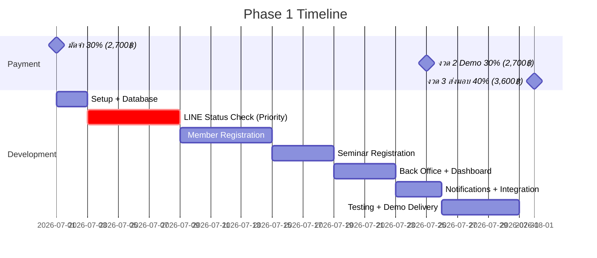

# แผนการพัฒนาและไทม์ไลน์

## ลำดับความสำคัญ (Priority)

จากการคุยกับลูกค้า — **ระบบเช็คสถานะผ่าน LINE OA ต้องทำก่อน**

| ลำดับ | งาน | หมายเหตุ |
|------|-----|----------|
| 1 | ออกแบบฐานข้อมูล + Backend พื้นฐาน | Foundation |
| 2 | จัดเตรียม LINE OA + Messaging API + LINE Login channel (LIFF) | ต้องสร้าง Gmail ใหม่ชื่อสมาคม — LIFF ต้องอยู่บน LINE Login channel ไม่ใช่ Messaging API |
| 3 | **ระบบเช็คสถานะผ่าน LINE OA** | ⭐ ลำดับแรก — ประมาณ 5–6 วัน |
| 4 | ระบบสมัครสมาชิก | Flow กรอกข้อมูล+แนบสลิปในขั้นตอนเดียว |
| 5 | ระบบสมัครสัมมนา | ดึงข้อมูลสมาชิกเดิมอัตโนมัติ |
| 6 | ระบบหลังบ้าน (Back Office) | แอดมิน + นายทะเบียน |
| 7 | ระบบแจ้งเตือน + เชื่อมโยงทุกส่วน | Event-driven notifications |

---

## ไทม์ไลน์โดยประมาณ (Phase 1 ทั้งหมด: 20–25 วัน)

```
วัน 0          ได้รับมัดจำงวดแรก (30%)
  │
  ├─ วัน 1–2     Setup: Firebase, LINE OA + LINE Login (LIFF), โครงสร้างโปรเจกต์
  │
  ├─ วัน 3–8     ⭐ ระบบเช็คสถานะ LINE OA (ลูกค้าขอให้เห็นผลก่อน)
  │
  ├─ วัน 9–14    ระบบสมัครสมาชิก + อัปโหลดสลิป
  │
  ├─ วัน 15–18   ระบบสมัครสัมมนา
  │
  ├─ วัน 19–22   ระบบหลังบ้าน + Dashboard
  │
  └─ วัน 23–25   แจ้งเตือน, ทดสอบ, ส่ง Demo → งวดที่ 2 (30%)
                  แก้ไขตาม feedback → ส่งมอบ → งวดที่ 3 (40%)
```

> ไทม์ไลน์นี้เป็นแผนงานโดยประมาณ ปรับได้ตามความคืบหน้าจริง

---

## Milestone และการชำระเงิน



---

## สิ่งที่ต้องเตรียมก่อนเริ่มพัฒนา / ก่อน go-live

> สถานะโค้ดล่าสุด: [13-Phase-1-Status-Audit-2026-07-22.md](./13-Phase-1-Status-Audit-2026-07-22.md)

### ฝั่งลูกค้า (ABTA)

- [x] ชำระมัดจำงวดแรก 30% (2,700 บาท)
- [x] สร้าง Gmail ใหม่ชื่อสมาคม (สำหรับ LINE OA)
- [x] สมัคร LINE Official Account + ตั้งค่า Messaging API + Webhook URL
- [x] สร้าง LINE Login channel + ลงทะเบียน LIFF app (ดู [07-Tech-Stack.md](./07-Tech-Stack.md))
- [ ] ยืนยัน LIFF Endpoint ใน Console ชี้ถูกหน้า
- [ ] ข้อมูลบัญชีธนาคารสำหรับรับโอน
- [ ] ข้อมูลสมาชิกเดิมชุดเต็ม สำหรับ import (มีตัวอย่างแล้ว)
- [ ] LINE User ID เจ้าหน้าที่ (`STAFF_LINE_USER_IDS`) — ถ้าต้องการรับแจ้ง

### ฝั่งผู้พัฒนา (เพชร)

- [x] Setup Firebase project
- [x] ออกแบบ Database schema
- [x] ส่ง UX/UI Flow (ส่งแล้ว 30 มิ.ย. 2569)
- [x] พัฒนาระบบเช็คสถานะ LINE OA เป็นอันดับแรก
- [x] สมัครสมาชิก / ผูก LINE เก่า / ต่ออายุ / สัมมนา / Back Office
- [ ] ปิด `ADMIN_OPEN_ACCESS` + ทดสอบ production

---

## การส่งมอบ (Deliverables)

| รอบ | สิ่งที่ส่ง | เงื่อนไขการชำระ |
|-----|-----------|----------------|
| Demo | ระบบที่ใช้งานได้ครบ 6 ส่วน (ทดสอบได้) | งวดที่ 2 — 30% |
| ส่งมอบ | ระบบสมบูรณ์ + แก้ไขตาม feedback | งวดที่ 3 — 40% |

---

## หมายเหตุจากการประชุม

- **10 ก.ค. 2569 09:30** — นัดพบคุณต๋อย (อุปนายก) ที่ร้านกาแฟใกล้ สจล.
- คุณต๋อยขอให้ร่าง UX/UI Flow ก่อนเริ่มพัฒนา → ส่งแล้ว 30 มิ.ย.
- คุณต๋อยเสนอให้รวม step สมัคร+โอนเงินเป็นขั้นตอนเดียว → ยืนยันแล้ว
