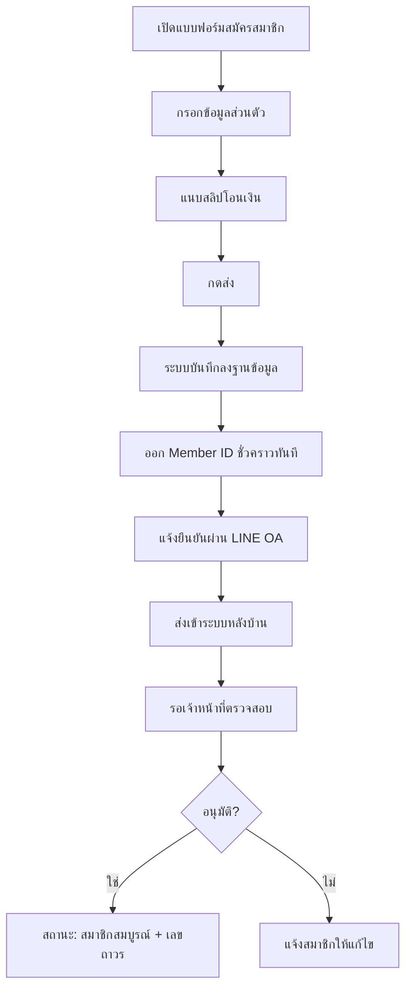
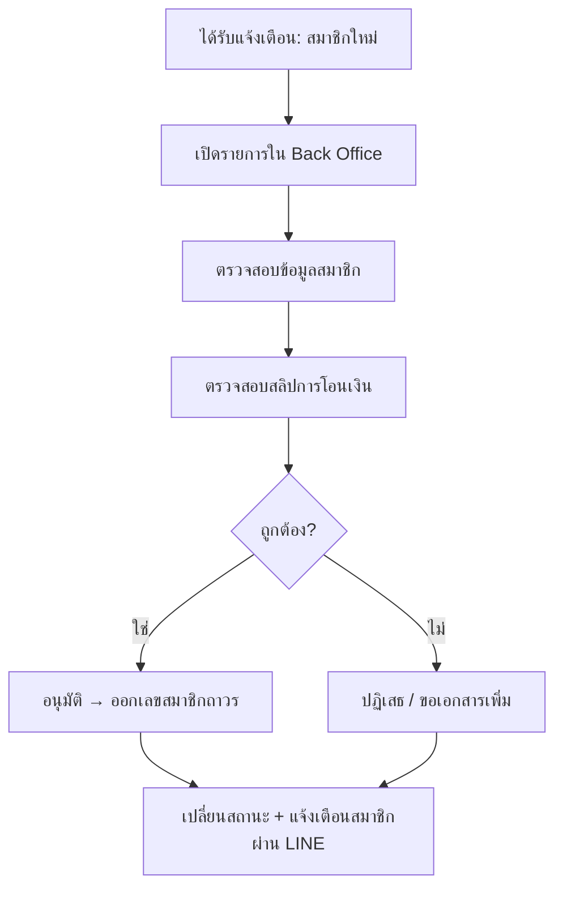

# Workflow การทำงานของระบบ

> Flow หลักถูกปรับตามคำแนะนำคุณต๋อย (30 มิ.ย. 2569)  
> จากเดิม 2 ขั้นตอน (กรอกข้อมูล → โอนเงิน) เป็น **ขั้นตอนเดียว**

---

## Flow ฝั่งสมาชิก

### สมัครสมาชิกใหม่



### สมาชิกเดิม — ต่ออายุ

```
LINE OA ตรวจสอบเบอร์โทร / LINE User ID
    ↓
ดึงข้อมูลเดิม → แสดงให้ตรวจสอบ → กดยืนยัน
    ↓
คำนวณค่าธรรมเนียม → แนบสลิป → ส่งให้นายทะเบียนอนุมัติ
```

### สมัครสัมมนา

```
เลือกงานสัมมนา
    ↓
ดึงข้อมูลสมาชิกอัตโนมัติ (ถ้ามีในระบบ)
    ↓
กรอกข้อมูลเพิ่มเติม (ไซส์เสื้อ, อาหาร ฯลฯ)
    ↓
แสดงสรุป → กด "ยืนยันการสมัคร"
    ↓
อัปโหลดสลิปชำระเงิน (ถ้ายังไม่ชำระ)
    ↓
รออนุมัติ → แจ้งเตือนผ่าน LINE
```

### เช็คสถานะ (LINE OA)

```
สมาชิกพิมพ์ "เช็คสถานะ"
    ↓
ระบบค้นหาจาก LINE User ID / เบอร์โทร
    ↓
ตอบกลับอัตโนมัติ:
  - Member ID
  - สถานะสมาชิก
  - สถานะการชำระเงิน
  - สถานะสัมมนา
  - วันหมดอายุ
  - สถานะการต่ออายุ
```

### ค้นหาเลขสมาชิก

สามารถค้นหาจาก: **ชื่อ, เลขสมาชิก, อีเมล, เบอร์โทร**

เมื่อพบ → แสดงสถานะ (ยังมีอายุ / หมดอายุแล้ว)

---

## Flow ฝั่งเจ้าหน้าที่ (Back Office)

### ตรวจสอบสมาชิกใหม่



### ตรวจสอบการชำระเงิน (Manual)

```
สมาชิกอัปโหลดสลิป
    ↓
ระบบบันทึก → สถานะ "รอตรวจสอบ"
    ↓
แจ้งเตือนแอดมิน/นายทะเบียนทันที
    ↓
เจ้าหน้าที่ตรวจสอบสลิป
    ↓
เปลี่ยนสถานะ → "ยืนยันการชำระเงินแล้ว"
    ↓
แจ้งเตือนสมาชิก
```

### อนุมัติสัมมนา

```
ได้รับแจ้งเตือน: มีผู้สมัครสัมมนา
    ↓
ตรวจสอบข้อมูล + สลิป
    ↓
อนุมัติ → สถานะ "ยืนยันสิทธิ์แล้ว"
    ↓
แจ้งเตือนสมาชิก
```

---

## บทบาทเจ้าหน้าที่

### Phase 1 (ยืนยันแล้ว)

| บทบาท | หน้าที่หลัก |
|-------|------------|
| **นายทะเบียน** | ตรวจสอบเอกสาร, อนุมัติสมาชิกใหม่/ต่ออายุ/สัมมนา |
| **แอดมิน** | รับแจ้งเตือนทุก Event, ดูรายงาน, จัดการข้อมูล |

### Phase 2 (วางแผน — ยังไม่ยืนยัน)

| บทบาท | หน้าที่หลัก |
|-------|------------|
| เลขานุการ | จัดการข้อมูลสมาชิก, ส่งข่าวสาร, ดูรายงาน |
| นายทะเบียน | ตรวจสอบเอกสาร, อนุมัติ, ออกเลขถาวร |
| เหรัญญิก | ตรวจสอบการชำระเงิน, ออกใบรับเงิน/ใบเสร็จ |
| กรรมการ | ดูรายงานและสถิติ |
| ผู้ดูแลระบบ | จัดการระบบทั้งหมด |

---

## UX/UI Flow

ส่งให้ลูกค้าดูแล้ว (30 มิ.ย. 2569):

- **รูปที่ 1** — Flow ฝั่งสมาชิก: สมัคร → ชำระเงิน → เช็คสถานะ LINE
- **รูปที่ 2** — Flow ฝั่งเจ้าหน้าที่: ตรวจสอบและอนุมัติใน Back Office

> ไฟล์รูปอยู่ในแชท LINE กลุ่มโครงการ
