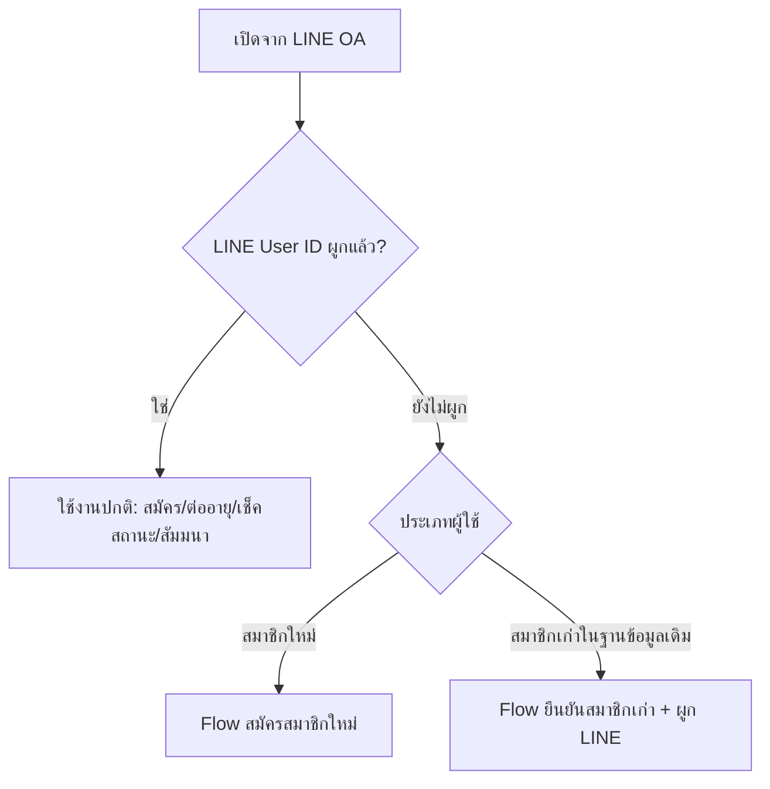
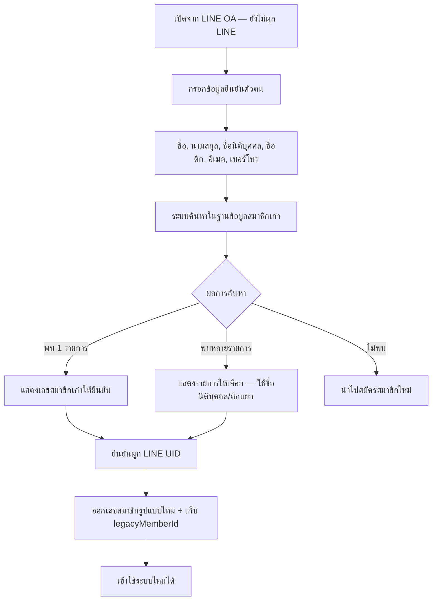
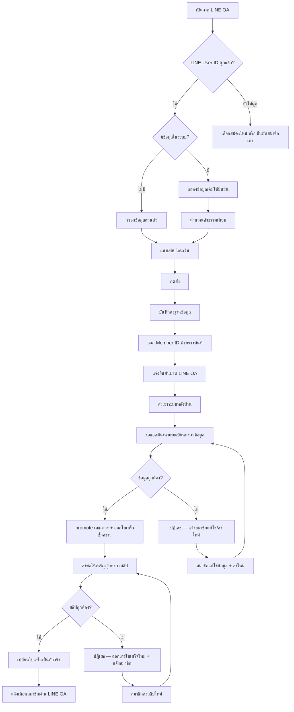
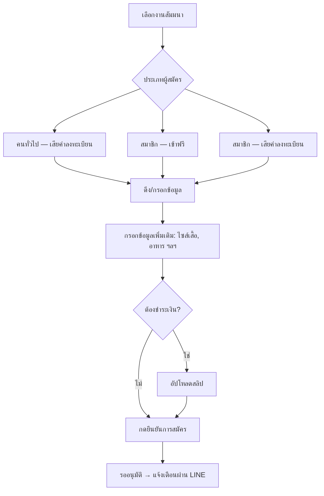
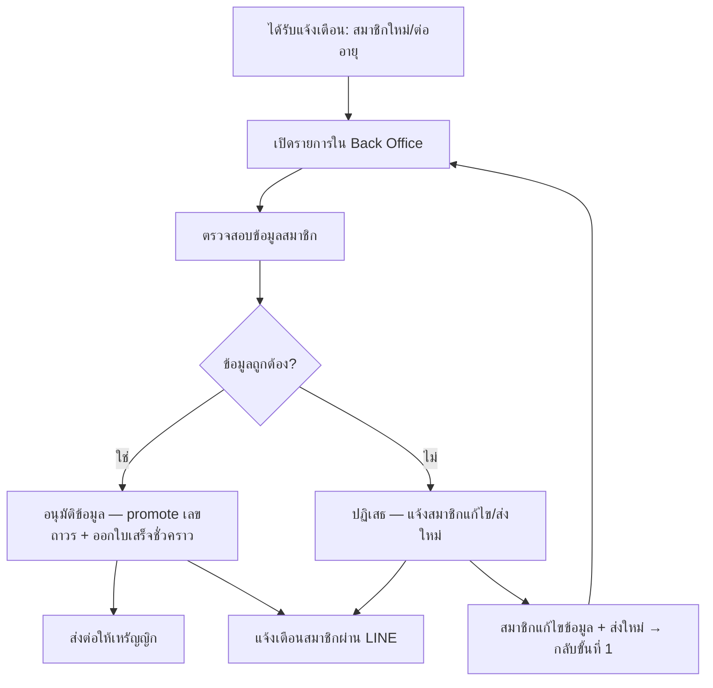
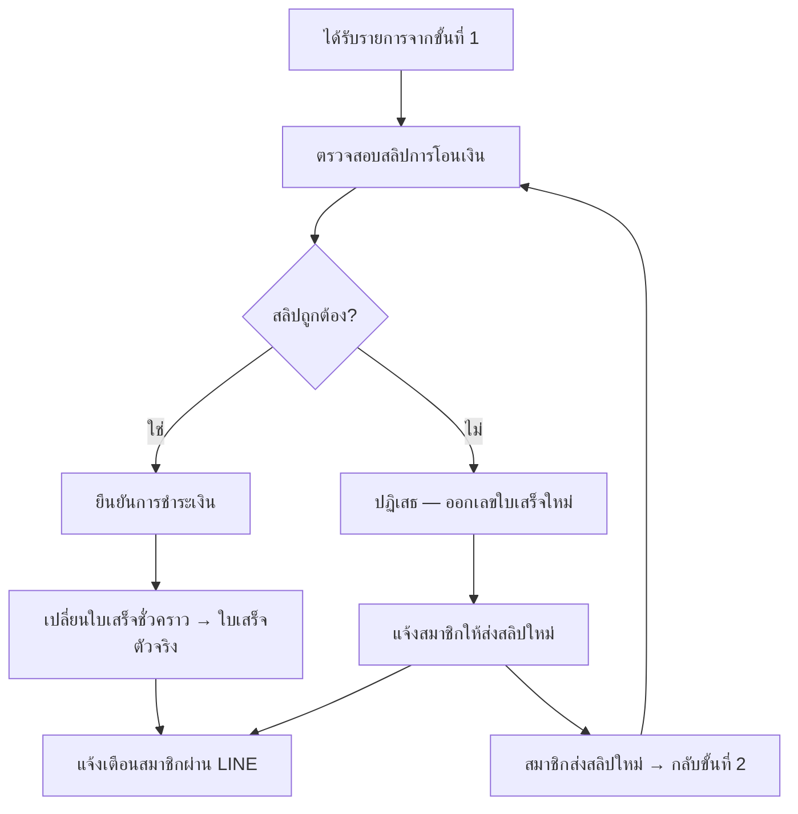
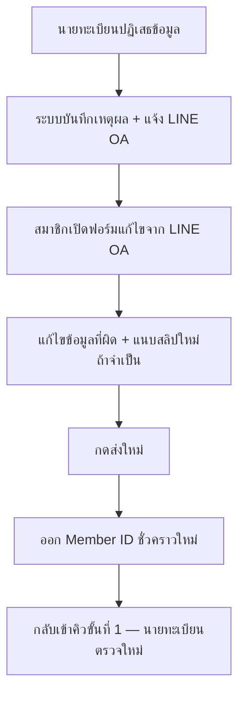
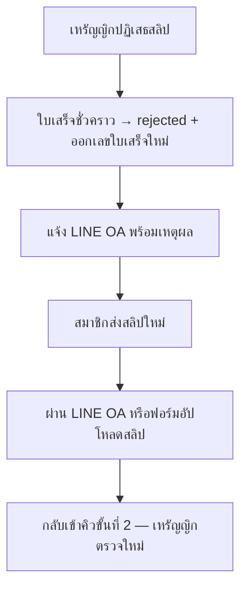

# Workflow การทำงานของระบบ

> Flow หลักถูกปรับตามคำแนะนำคุณต๋อย (30 มิ.ย. 2569)  
> จากเดิม 2 ขั้นตอน (กรอกข้อมูล → โอนเงิน) เป็น **ขั้นตอนเดียว**  
> **อัปเดต Flow Phase 1 ครบถ้วน:** 11 ก.ค. 2569 (ยืนยันกับลูกค้า)  
> **อัปเดต Flow สมัครสมาชิก:** 12 ก.ค. 2569 — ออกเลขสมาชิกก่อน ผ่านนายทะเบียนแล้ว promote เลขถาวร + ออกใบเสร็จชั่วคราว  
> **อัปเดต Flow ผูก LINE UID สมาชิกเก่า:** 13 ก.ค. 2569 — ยืนยันตัวตนก่อนผูก LINE + ออกเลขสมาชิกรูปแบบใหม่  
> **อัปเดต Exception Flows:** 13 ก.ค. 2569 — ปฏิเสธข้อมูลวนกลับสมาชิก, flow ส่งใหม่, สิทธิ์สมาชิกชั่วคราว, edge cases

---

## ภาพรวมช่องทาง

| ช่องทาง | ผู้ใช้ | หน้าที่ |
|---------|--------|---------|
| **LINE OA** | สมาชิก | สมัคร, ยืนยันสมาชิกเก่า, ต่ออายุ, สมัครสัมมนา, เช็คสถานะ, ดูบัตรสมาชิก + ใบเสร็จ |
| **Web / LIFF** | สมาชิก | ฟอร์มกรอกข้อมูล + อัปโหลดสลิป (เปิดจาก LINE OA ผ่าน Rich Menu) |
| **Back Office** | แอดมิน / นายทะเบียน / เหรัญญิก | ตรวจสอบ อนุมัติ จัดการข้อมูล |

> **เทคนิค:** LIFF ลงทะเบียนบน **LINE Login channel** (ไม่ใช่ Messaging API) — สมาชิกยังเปิดฟอร์มจาก LINE OA ได้ตามปกติ ดู [07-Tech-Stack.md](./07-Tech-Stack.md)

---

## Flow ฝั่งสมาชิก

### จุดเข้าใช้งาน — เช็ค LINE User ID



### ยืนยันสมาชิกเก่า + ผูก LINE UID

> สำหรับสมาชิกที่มีอยู่ในฐานข้อมูลเก่า แต่ยังไม่เคยผูก LINE User ID



**รายละเอียดขั้นตอน:**

1. เปิดฟอร์มจาก LINE OA (Web/LIFF) — ผู้ใช้ที่ยังไม่มี LINE User ID ในระบบ
2. กรอกข้อมูลยืนยันตัวตน: ชื่อ, นามสกุล, ชื่อนิติบุคคล, ชื่อตึก, อีเมล, เบอร์โทร
3. ระบบค้นหาในฐานข้อมูลสมาชิกเก่า โดย **match หลายฟิลด์ร่วมกัน** (ไม่ใช้แค่อีเมลหรือเบอร์อย่างเดียว)
4. ถ้าพบ → แสดงเลขสมาชิกเก่าให้ยืนยัน / ถ้าพบหลายรายการ → ให้เลือกรายการที่ตรง
5. ถ้าไม่พบ → นำไป Flow สมัครสมาชิกใหม่
6. หลังยืนยัน → ผูก LINE UID + ออกเลขสมาชิกรูปแบบใหม่ (เช่น `ABTA-2026-XXXX`)
7. เข้าใช้ระบบใหม่ได้ทันที (เช็คสถานะ, ต่ออายุ, สัมมนา ฯลฯ)

**Logic การค้นหา — ข้อมูลซ้ำในฐานข้อมูลเก่า:**

| สถานการณ์ | การจัดการ |
|-----------|-----------|
| อีเมล/เบอร์เดียวกัน หลายสมาชิก | ใช้ชื่อ + นามสกุล + ชื่อนิติบุคคล + ชื่อตึก ร่วมกันในการ match |
| Match ได้ 1 รายการ | แสดงเลขสมาชิกเก่า → กดยืนยันผูก LINE |
| Match ได้หลายรายการ | แสดงรายการทั้งหมด (ชื่อนิติบุคคล, ตึก, เลขเก่า) ให้เลือก |
| ไม่พบเลย | แนะนำให้สมัครสมาชิกใหม่ |

> สาเหตุข้อมูลซ้ำ: สมัยก่อนมีสมาชิกที่ไม่มีอีเมล แอดมินจึงใช้อีเมลตัวเองสมัครแทนหลายคน

### สมัครสมาชิก (ใหม่ / ต่ออายุ)



**รายละเอียดขั้นตอน (สมัครใหม่):**

1. เปิดฟอร์มจาก LINE OA (Web/LIFF) — ผู้ใช้ที่ยังไม่ผูก LINE หรือเลือกสมัครใหม่
2. สมาชิกใหม่ → กรอกชื่อ, นามสกุล, ชื่อนิติบุคคล, อีเมล, เบอร์, ชื่อตึก ฯลฯ + แนบสลิป (ขั้นตอนเดียว)
3. หลังกดส่ง → ออก **Member ID ชั่วคราว** ทันที (ภายใน 5 นาที) — ใบเสร็จชั่วคราวออก**หลังนายทะเบียนอนุมัติข้อมูล**
4. แจ้งยืนยันผ่าน LINE OA (พร้อมเลขสมาชิก) → ส่งเข้า Back Office

### สมาชิกเดิม — ต่ออายุ (ผูก LINE แล้ว)

```
LINE OA ตรวจสอบ LINE User ID (ต้องผูกแล้ว)
    ↓
ดึงข้อมูลเดิม → แสดงให้ตรวจสอบ → กดยืนยัน
    ↓
คำนวณค่าธรรมเนียม → แนบสลิป → ออกเลขสมาชิกชั่วคราวทันที
    ↓
ส่งเข้า Back Office → นายทะเบียนตรวจข้อมูล (ผ่าน → ออกใบเสร็จชั่วคราว) → เหรัญญิกตรวจสลิป
```

### สมัครสัมมนา



**ประเภทการจัดสัมมนา (3 แบบ):**

| ประเภท | เงื่อนไข | ค่าลงทะเบียน |
|--------|----------|-------------|
| `public_paid` | คนทั่วไป | ต้องชำระ |
| `member_free` | สมาชิกที่ยังมีอายุ (รวมสมาชิกชั่วคราว) | ฟรี |
| `member_paid` | สมาชิก (หรือตามที่กำหนดต่องาน) | ต้องชำระ |

### เช็คสถานะ / ดูข้อมูล (LINE OA)

```
สมาชิกพิมพ์ "เช็คสถานะ" (หรือเลือกจาก Rich Menu)
    ↓
ระบบค้นหาจาก LINE User ID / เบอร์โทร
    ↓
ตอบกลับอัตโนมัติ:
  - Member ID + สถานะสมาชิก
  - บัตรสมาชิก (Member ID Card)
  - ใบเสร็จ (ชั่วคราว / ตัวจริง)
  - สถานะการชำระเงิน
  - สถานะสัมมนา
  - วันหมดอายุ
  - สถานะการต่ออายุ
```

### ค้นหาเลขสมาชิก

สามารถค้นหาจาก: **ชื่อ, เลขสมาชิก, อีเมล, เบอร์โทร** (Back Office)

สำหรับ **ยืนยันสมาชิกเก่าฝั่ง LINE** — ใช้ match หลายฟิลด์ร่วมกัน (ชื่อ + นามสกุล + ชื่อนิติบุคคล + ชื่อตึก + อีเมล + เบอร์) ไม่ใช้แค่อีเมลหรือเบอร์อย่างเดียว

เมื่อพบ → แสดงสถานะ (ยังมีอายุ / หมดอายุแล้ว)

---

## Flow ฝั่งเจ้าหน้าที่ (Back Office)

### ขั้นที่ 1 — แอดมิน / นายทะเบียน ตรวจข้อมูลสมาชิก



### ขั้นที่ 2 — เหรัญญิก ตรวจสลิปและใบเสร็จ



### อนุมัติสัมมนา

```
ได้รับแจ้งเตือน: มีผู้สมัครสัมมนา
    ↓
ตรวจสอบข้อมูล + สลิป (ถ้ามีการชำระ)
    ↓
อนุมัติ → สถานะ "ยืนยันสิทธิ์แล้ว"
    ↓
แจ้งเตือนสมาชิก
```

---

## สิทธิ์สมาชิกชั่วคราว

> **หลักการ:** สมาชิกชั่วคราวได้**สิทธิ์ครบเหมือนสมาชิกสมบูรณ์** — คำว่า "ชั่วคราว" หมายถึงเลขสมาชิก / ใบเสร็จยังรอการตรวจสอบจากเจ้าหน้าที่ **ไม่ใช่** การจำกัดสิทธิ์การใช้งาน

| สิทธิ์ | สมาชิกชั่วคราว | หมายเหตุ |
|--------|:--------------:|----------|
| เช็คสถานะผ่าน LINE OA | ✅ | แสดง Member ID ปัจจุบัน |
| ดูบัตรสมาชิก (Member ID Card) | ✅ | |
| ดูใบเสร็จ | ✅ | แสดงตามสถานะ (ยังไม่มี / ชั่วคราว / ตัวจริง) |
| สมัครสัมมนา `member_free` | ✅ | ถ้ายังไม่หมดอายุ |
| สมัครสัมมนา `member_paid` | ✅ | ตามเงื่อนไขงาน |
| ต่ออายุสมาชิก | ✅ | |

สถานะ **สมาชิกสมบูรณ์** หมายถึงนายทะเบียน promote เลขถาวรแล้ว — แยกจากสถานะการชำระเงิน (ที่เหรัญญิกตรวจในขั้นที่ 2)

---

## Exception Flows — ส่งใหม่หลังปฏิเสธ

### กรณีที่ 1 — นายทะเบียนไม่ผ่าน (ข้อมูลไม่ถูกต้อง)



| รายการ | การจัดการ |
|--------|-----------|
| ใบเสร็จ | **ยังไม่ออก** — รอนายทะเบียนอนุมัติข้อมูลก่อน |
| เหรัญญิก | **ไม่ส่งต่อ** — จนกว่าข้อมูลจะผ่านขั้นที่ 1 |
| Member ID | ออกเลขชั่วคราวใหม่ทุกครั้งที่ส่งใหม่ (เก็บเลขเก่าใน audit log) |
| สิทธิ์สมาชิก | ยังใช้งานได้ครบ — สถานะยังเป็น "สมาชิกชั่วคราว" |
| ช่องทางส่งใหม่ | ฟอร์มเดิมจาก LINE OA (LIFF) |

### กรณีที่ 2 — เหรัญญิกไม่ผ่าน (สลิปไม่ถูกต้อง)



| รายการ | การจัดการ |
|--------|-----------|
| Member ID | **คงเลขถาวร** — promote แล้วตั้งแต่ขั้นที่ 1 |
| สถานะสมาชิก | **สมาชิกสมบูรณ์** — ไม่เปลี่ยนแม้สลิปไม่ผ่าน |
| ใบเสร็จ | `rejected` → ออกเลขใบเสร็จใหม่เมื่อเหรัญญิกอนุมัติครั้งถัดไป |
| ช่องทางส่งใหม่ | อัปโหลดสลิปผ่าน LINE OA หรือ LIFF (ไม่ต้องกรอกข้อมูลใหม่ทั้งหมด) |

---

## Edge Cases — สถานการณ์พิเศษ

> กรณีต่อไปนี้จัดการผ่าน **ข้อความในระบบ + แชท LINE กลุ่มโครงการ / ติดต่อแอดมิน** (Phase 1 ไม่ทำ self-service แก้ไขบัญชี)

| สถานการณ์ | การจัดการในระบบ | การจัดการเพิ่มเติม |
|-----------|----------------|-------------------|
| สมาชิกเก่าผูก LINE สำเร็จ แต่**หมดอายุ**แล้ว | เข้าใช้ระบบได้ → แสดงสถานะ "หมดอายุ" → นำไป Flow **ต่ออายุ** | — |
| สมาชิกเก่า**เลือกรายการผูก LINE ผิด** | ไม่มี self-service ยกเลิกใน Phase 1 | ติดต่อแอดมินผ่านแชท → แอดมินแก้ไขใน Back Office |
| legacy record **ถูกผูก LINE ไปแล้ว** (คนอื่น) | แสดงข้อความ "รายการนี้ถูกผูกแล้ว" | ติดต่อแอดมินผ่านแชท |
| **LINE UID นี้ผูกกับ account อื่น**แล้ว | แสดงข้อความแจ้ง conflict | ติดต่อแอดมินผ่านแชท |
| ยืนยันตัวตน**ไม่พบในฐานเก่า** แต่เคยเป็นสมาชิกจริง | แนะนำสมัครใหม่ หรือ | ติดต่อแอดมินผ่านแชทเพื่อตรวจสอบข้อมูลด้วยมือ |
| **คนทั่วไป**สมัครสัมมนา `public_paid` | เปิด LIFF จาก LINE OA — **ไม่ต้อง**เป็นสมาชิก / ผูก LINE | กรอกข้อมูล + สลิปในฟอร์ม |
| สมาชิก**หมดอายุ**สมัครสัมมนา `member_paid` | คิดราคาตามประเภทสมาชิกของงาน (ไม่ได้สิทธิ์ `member_free`) | — |
| ส่งซ้ำหลายครั้งก่อนอนุมัติ | รับส่งใหม่ได้เรื่อย ๆ — ใช้ Member ID / เลขใบเสร็จล่าสุด | — |

---

## บทบาทเจ้าหน้าที่

### Phase 1 (ยืนยันแล้ว)

| บทบาท | หน้าที่หลัก | ลำดับ |
|-------|------------|-------|
| **แอดมิน** | รับแจ้งเตือนทุก Event, ดูรายงาน, จัดการข้อมูล | — |
| **นายทะเบียน** | ตรวจสอบข้อมูลสมาชิก, promote เลขถาวร + ออกใบเสร็จชั่วคราวเมื่อผ่าน, อนุมัติสมาชิกใหม่/ต่ออายุ/สัมมนา | ขั้นที่ 1 |
| **เหรัญญิก** | ตรวจสอบสลิป, ออก/ยืนยันใบรับเงิน/ใบเสร็จตัวจริง | ขั้นที่ 2 |

> ใน Phase 1 คนเดียวอาจทำหลายบทบาทได้ แต่ระบบแยกขั้นตอนตรวจ **ข้อมูล** กับ **การเงิน** ชัดเจน

### Phase 2 (วางแผน — ยังไม่ยืนยัน)

| บทบาท | หน้าที่หลัก |
|-------|------------|
| เลขานุการ | จัดการข้อมูลสมาชิก, ส่งข่าวสาร, ดูรายงาน |
| กรรมการ | ดูรายงานและสถิติ |
| ผู้ดูแลระบบ | จัดการระบบทั้งหมด, Dashboard แยกสิทธิ์เต็มรูปแบบ |

---

## UX/UI Flow

ส่งให้ลูกค้าดูแล้ว (30 มิ.ย. 2569):

- **รูปที่ 1** — Flow ฝั่งสมาชิก: สมัคร → ชำระเงิน → เช็คสถานะ LINE
- **รูปที่ 2** — Flow ฝั่งเจ้าหน้าที่: ตรวจสอบและอนุมัติใน Back Office

> ไฟล์รูปอยู่ในแชท LINE กลุ่มโครงการ
