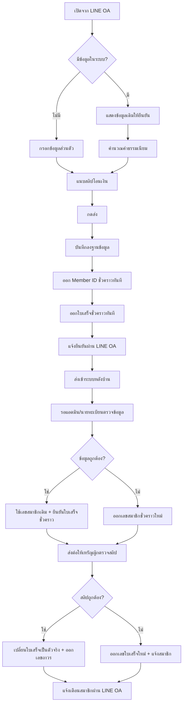
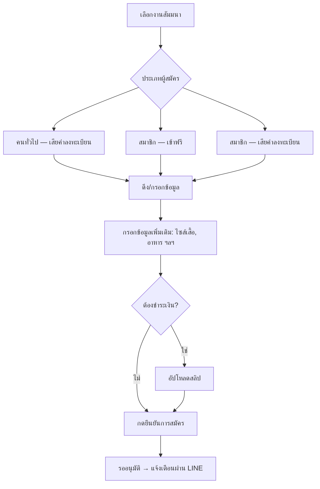
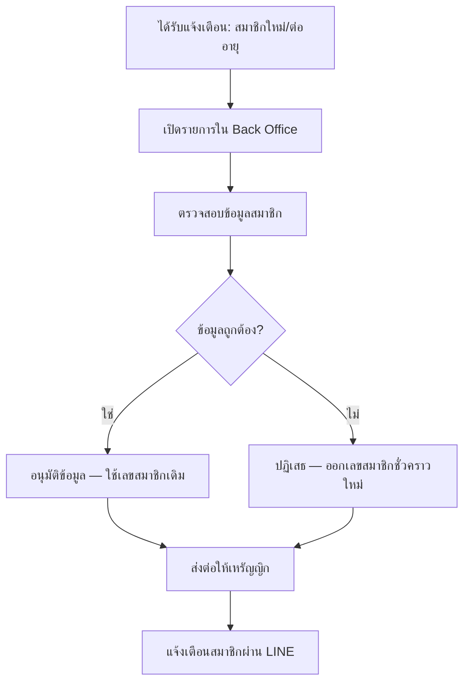
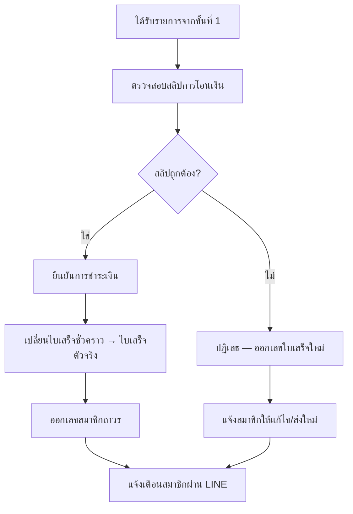

# Workflow การทำงานของระบบ

> Flow หลักถูกปรับตามคำแนะนำคุณต๋อย (30 มิ.ย. 2569)  
> จากเดิม 2 ขั้นตอน (กรอกข้อมูล → โอนเงิน) เป็น **ขั้นตอนเดียว**  
> **อัปเดต Flow Phase 1 ครบถ้วน:** 11 ก.ค. 2569 (ยืนยันกับลูกค้า)

---

## ภาพรวมช่องทาง

| ช่องทาง | ผู้ใช้ | หน้าที่ |
|---------|--------|---------|
| **LINE OA** | สมาชิก | สมัคร, ต่ออายุ, สมัครสัมมนา, เช็คสถานะ, ดูบัตรสมาชิก + ใบเสร็จ |
| **Web / LIFF** | สมาชิก | ฟอร์มกรอกข้อมูล + อัปโหลดสลิป (เปิดจาก LINE OA) |
| **Back Office** | แอดมิน / นายทะเบียน / เหรัญญิก | ตรวจสอบ อนุมัติ จัดการข้อมูล |

---

## Flow ฝั่งสมาชิก

### สมัครสมาชิก (ใหม่ / เดิม / ต่ออายุ)



**รายละเอียดขั้นตอน:**

1. เปิดฟอร์มจาก LINE OA (Web/LIFF)
2. ระบบเช็คเบอร์โทร / LINE User ID — ถ้ามีข้อมูลเดิม แสดงให้ยืนยัน (ไม่ต้องกรอกซ้ำ)
3. สมาชิกใหม่ → กรอกชื่อ, อีเมล, เบอร์, หน่วยงาน ฯลฯ + แนบสลิป (ขั้นตอนเดียว)
4. หลังกดส่ง → ออก **Member ID ชั่วคราว** และ **ใบเสร็จชั่วคราว** ทันที (ภายใน 5 นาที)
5. แจ้งยืนยันผ่าน LINE OA → ส่งเข้า Back Office

### สมาชิกเดิม — ต่ออายุ

```
LINE OA ตรวจสอบเบอร์โทร / LINE User ID
    ↓
ดึงข้อมูลเดิม → แสดงให้ตรวจสอบ → กดยืนยัน
    ↓
คำนวณค่าธรรมเนียม → แนบสลิป → ออกเลขชั่วคราว + ใบเสร็จชั่วคราว
    ↓
ส่งเข้า Back Office → แอดมินตรวจข้อมูล → เหรัญญิกตรวจสลิป
```

### สมัครสัมมนา



**ประเภทการจัดสัมมนา (3 แบบ):**

| ประเภท | เงื่อนไข | ค่าลงทะเบียน |
|--------|----------|-------------|
| `public_paid` | คนทั่วไป | ต้องชำระ |
| `member_free` | สมาชิกที่ยังมีอายุ | ฟรี |
| `member_paid` | สมาชิก (หรือตามที่กำหนดต่องาน) | ต้องชำระ |

### เช็คสถานะ / ดูข้อมูล (LINE OA)

```
สมาชิกพิมพ์ "เช็คสถานะ" (หรือเลือกจาก Rich Menu)
    ↓
ระบบค้นหาจาก LINE User ID / เบอร์โทร
    ↓
ตอบกลับอัตโนมัติ:
  - Member ID + สถานะสมาชิก
  - บัตรสมาชิก (Member ID Card)
  - ใบเสร็จ (ชั่วคราว / ตัวจริง)
  - สถานะการชำระเงิน
  - สถานะสัมมนา
  - วันหมดอายุ
  - สถานะการต่ออายุ
```

### ค้นหาเลขสมาชิก

สามารถค้นหาจาก: **ชื่อ, เลขสมาชิก, อีเมล, เบอร์โทร**

เมื่อพบ → แสดงสถานะ (ยังมีอายุ / หมดอายุแล้ว)

---

## Flow ฝั่งเจ้าหน้าที่ (Back Office)

### ขั้นที่ 1 — แอดมิน / นายทะเบียน ตรวจข้อมูลสมาชิก



### ขั้นที่ 2 — เหรัญญิก ตรวจสลิปและใบเสร็จ



### อนุมัติสัมมนา

```
ได้รับแจ้งเตือน: มีผู้สมัครสัมมนา
    ↓
ตรวจสอบข้อมูล + สลิป (ถ้ามีการชำระ)
    ↓
อนุมัติ → สถานะ "ยืนยันสิทธิ์แล้ว"
    ↓
แจ้งเตือนสมาชิก
```

---

## บทบาทเจ้าหน้าที่

### Phase 1 (ยืนยันแล้ว)

| บทบาท | หน้าที่หลัก | ลำดับ |
|-------|------------|-------|
| **แอดมิน** | รับแจ้งเตือนทุก Event, ดูรายงาน, จัดการข้อมูล | — |
| **นายทะเบียน** | ตรวจสอบข้อมูลสมาชิก, อนุมัติสมาชิกใหม่/ต่ออายุ/สัมมนา | ขั้นที่ 1 |
| **เหรัญญิก** | ตรวจสอบสลิป, ออก/ยืนยันใบรับเงิน/ใบเสร็จ, ออกเลขถาวร | ขั้นที่ 2 |

> ใน Phase 1 คนเดียวอาจทำหลายบทบาทได้ แต่ระบบแยกขั้นตอนตรวจ **ข้อมูล** กับ **การเงิน** ชัดเจน

### Phase 2 (วางแผน — ยังไม่ยืนยัน)

| บทบาท | หน้าที่หลัก |
|-------|------------|
| เลขานุการ | จัดการข้อมูลสมาชิก, ส่งข่าวสาร, ดูรายงาน |
| กรรมการ | ดูรายงานและสถิติ |
| ผู้ดูแลระบบ | จัดการระบบทั้งหมด, Dashboard แยกสิทธิ์เต็มรูปแบบ |

---

## UX/UI Flow

ส่งให้ลูกค้าดูแล้ว (30 มิ.ย. 2569):

- **รูปที่ 1** — Flow ฝั่งสมาชิก: สมัคร → ชำระเงิน → เช็คสถานะ LINE
- **รูปที่ 2** — Flow ฝั่งเจ้าหน้าที่: ตรวจสอบและอนุมัติใน Back Office

> ไฟล์รูปอยู่ในแชท LINE กลุ่มโครงการ
