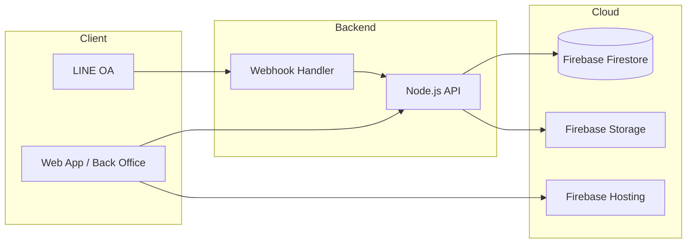

# เทคโนโลยีและค่าใช้จ่าย

> หมายเหตุ: เป็นแผนการพัฒนาของผู้พัฒนา ยังไม่ได้ระบุเป็นข้อกำหนดในสัญญา

---

## Tech Stack ที่วางแผนใช้

| ชั้น | เทคโนโลยี |
|------|----------|
| **Frontend** | React |
| **Backend** | Node.js |
| **Database** | Firebase (Firestore) |
| **LINE Integration** | LINE Messaging API + Webhook |
| **Hosting** | Firebase Hosting |

### ทางเลือกอื่นที่เคยพิจารณา

- Backend: Python
- Database: Supabase
- Hosting: Cloudflare Pages

---

## การตั้งค่า LINE Official Account

ขั้นตอนที่ลูกค้าต้องทำ (หรือทำร่วมกับผู้พัฒนา):

1. สร้าง **Gmail ใหม่** ชื่อสมาคม
2. สมัคร **LINE Official Account**
3. ตั้งค่า **Messaging API**
4. กำหนด **Webhook URL** ชี้ไปที่ Backend
5. เปิดใช้งาน Webhook

---

## สถาปัตยกรรมโดยย่อ

### การไหลของข้อมูลหลัก

| Event | Flow |
|-------|------|
| สมาชิกสมัคร | Web Form → API → Firestore → LINE Notify |
| สมาชิกพิมพ์ "เช็คสถานะ" | LINE → Webhook → API → Firestore → LINE Reply |
| แอดมินอนุมัติ | Back Office → API → Firestore → LINE Notify |
| อัปโหลดสลิป | Web/LINE → API → Firebase Storage → Firestore |

---

## ค่าใช้จ่ายรายเดือน (หลังส่งมอบ)

> **ลูกค้าเป็นผู้รับผิดชอบ** ค่าบริการภายนอก

| บริการ | ค่าใช้จ่ายโดยประมาณ | หมายเหตุ |
|--------|---------------------|----------|
| LINE Official Account | 400–1,500 บาท/เดือน | ตามแพ็กเกจ |
| Firebase | ฟรี – 500+ บาท/เดือน | ฟรีถ้าไม่เกิน Free Tier |
| AI API (ถ้าเพิ่ม OCR) | 200–500 บาท/เดือน | ขึ้นกับจำนวนสลิป |

### สรุปค่ารายเดือน

| แพ็กเกจ | ประมาณ |
|---------|--------|
| Phase 1 (ไม่มี AI) | **400–2,000 บาท/เดือน** |
| Phase 3–4 (มี OCR) | **600–2,500 บาท/เดือน** |

> ถ้าสมาชิกน้อยและใช้งานไม่หนัก อาจอยู่ใน Free Tier ได้

---

## ข้อมูลที่ต้องเก็บในฐานข้อมูล

### ตาราง Members

| Field | Type | หมายเหตุ |
|-------|------|----------|
| memberId | string | ชั่วคราว → ถาวร |
| firstName | string | |
| lastName | string | |
| phone | string | ใช้ค้นหา + ผูก LINE |
| email | string | |
| organization | string | หน่วยงาน/ตึก |
| lineUserId | string | ผูกกับ LINE OA |
| status | enum | ดู [05-Status-and-SLA.md](./05-Status-and-SLA.md) |
| expiryDate | timestamp | วันหมดอายุ |
| createdAt | timestamp | |
| updatedAt | timestamp | |

### ตาราง Seminars / Registrations

| Field | Type |
|-------|------|
| seminarId | string |
| memberId | string |
| shirtSize | string |
| foodPreference | string |
| paymentStatus | enum |
| registrationStatus | enum |

### ตาราง Payments

| Field | Type |
|-------|------|
| paymentId | string |
| memberId | string |
| slipUrl | string |
| amount | number |
| status | enum |
| verifiedBy | string |
| verifiedAt | timestamp |

---

## ผลงานอ้างอิง

- Portfolio: https://pkfreelancebs.web.app/
