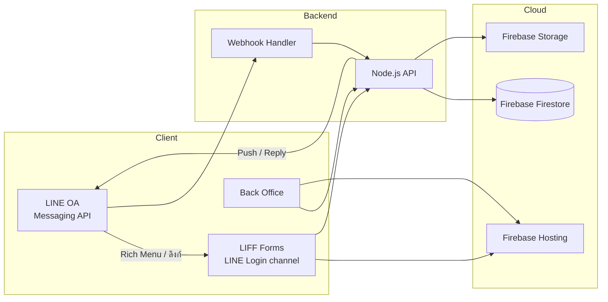

# เทคโนโลยีและค่าใช้จ่าย

> หมายเหตุ: เป็นแผนการพัฒนาของผู้พัฒนา ยังไม่ได้ระบุเป็นข้อกำหนดในสัญญา

---

## Tech Stack ที่วางแผนใช้

| ชั้น | เทคโนโลยี |
|------|----------|
| **Frontend** | React |
| **Backend** | Node.js |
| **Database** | Firebase (Firestore) |
| **LINE Integration** | Messaging API (LINE OA) + LINE Login channel (LIFF) + Webhook |
| **Hosting** | Firebase Hosting |

### ทางเลือกอื่นที่เคยพิจารณา

- Backend: Python
- Database: Supabase
- Hosting: Cloudflare Pages

---

## การตั้งค่า LINE (2 Channels)

> **นโยบาย LINE:** ตั้งแต่ ก.พ. 2020 ห้ามสร้าง LIFF app บน Messaging API channel — ต้องใช้ **LINE Login channel** แยกต่างหาก ([อ้างอิง](https://developers.line.biz/en/news/2019/11/11/liff-cannot-be-used-with-messaging-api-channels/))  
> Flow ฝั่งสมาชิกยังเปิดฟอร์มจาก LINE OA ได้ตามปกติ (Rich Menu / ลิงก์) แต่ LIFF ลงทะเบียนบน LINE Login channel

ระบบ ABTA ใช้ **2 channel ภายใต้ Provider เดียวกัน**:

| Channel | หน้าที่ | ใช้ในระบบ ABTA |
|---------|--------|----------------|
| **Messaging API** | LINE Official Account — ส่งข้อความ, Webhook, Rich Menu | เช็คสถานะ, แจ้งเตือน, Reply/Push |
| **LINE Login** | LIFF app — ฟอร์มเว็บใน LINE, ดึง `lineUserId` | สมัครสมาชิก, ยืนยันสมาชิกเก่า, สัมมนา, อัปโหลดสลิป |

### ขั้นตอนที่ลูกค้าต้องทำ (หรือทำร่วมกับผู้พัฒนา)

**เตรียมบัญชี**

1. สร้าง **Gmail ใหม่** ชื่อสมาคม
2. สร้าง **Provider** บน [LINE Developers Console](https://developers.line.biz/console/)

**Channel 1 — Messaging API (LINE OA)**

3. สมัคร **LINE Official Account** และเชื่อมกับ Messaging API channel
4. ตั้งค่า **Messaging API** — เก็บ Channel ID, Channel Secret, Channel Access Token
5. กำหนด **Webhook URL** ชี้ไปที่ Backend
6. เปิดใช้งาน Webhook
7. ตั้ง **Rich Menu** — ปุ่มเปิด LIFF URL (ชี้ไปฟอร์มบน Firebase Hosting)

**Channel 2 — LINE Login (LIFF)**

8. สร้าง **LINE Login channel** ภายใต้ Provider เดียวกัน
9. เพิ่ม **LIFF app** บนแท็บ LIFF ของ LINE Login channel
   - Endpoint URL → Firebase Hosting (เช่น `https://abta-xxxxx.web.app/liff/register`)
   - Size: Full
   - Scopes: `profile`, `openid` (ดึง LINE User ID)
10. เก็บ **LIFF ID** แต่ละฟอร์ม (ใช้ใน `liff.init()` และ Rich Menu)

**LIFF apps ที่วางแผนไว้ (Phase 1)**

| LIFF App | ใช้กับ Flow |
|----------|-------------|
| สมัครสมาชิกใหม่ | กรอกข้อมูล + แนบสลิป |
| ยืนยันสมาชิกเก่า | ค้นหา legacy + ผูก LINE UID |
| ต่ออายุสมาชิก | กรอก/ยืนยันข้อมูล + สลิป |
| สมัครสัมมนา | ลงทะเบียน + สลิป (ถ้าต้องจ่าย) |
| อัปโหลดสลิป | ส่งสลิปใหม่หลัง reject |

> อาจรวมเป็นหน้าเดียวแล้ว route ตาม query param (`?flow=register|legacy|renewal|seminar|slip`) หรือแยก LIFF app ตามฟอร์ม — ตัดสินใจตอน implement

**Credentials ที่ Backend ต้องเก็บ**

| ตัวแปร | มาจาก |
|--------|-------|
| `LINE_MESSAGING_CHANNEL_SECRET` | Messaging API channel |
| `LINE_MESSAGING_ACCESS_TOKEN` | Messaging API channel |
| `LINE_LOGIN_CHANNEL_ID` | LINE Login channel (ถ้าต้อง verify ID token) |
| `LIFF_ID_*` | แต่ละ LIFF app |

---

## สถาปัตยกรรมโดยย่อ

### การไหลของข้อมูลหลัก

| Event | Flow |
|-------|------|
| สมาชิกสมัคร | Web Form → API → Firestore → LINE Notify |
| สมาชิกเก่ายืนยันตัวตน + ผูก LINE | LIFF Form → API → ค้นหา Legacy DB → ผูก lineUserId → ออก memberId ใหม่ → LINE Notify |
| สมาชิกพิมพ์ "เช็คสถานะ" | LINE → Webhook → API → Firestore → LINE Reply |
| แอดมินอนุมัติข้อมูล | Back Office → API → Firestore → LINE Notify |
| เหรัญญิกอนุมัติสลิป | Back Office → API → Firestore → LINE Notify |
| อัปโหลดสลิป | Web/LINE → API → Firebase Storage → Firestore |

---

## ค่าใช้จ่ายรายเดือน (หลังส่งมอบ)

> **ลูกค้าเป็นผู้รับผิดชอบ** ค่าบริการภายนอก

| บริการ | ค่าใช้จ่ายโดยประมาณ | หมายเหตุ |
|--------|---------------------|----------|
| LINE Official Account | 400–1,500 บาท/เดือน | ตามแพ็กเกจ |
| Firebase | ฟรี – 500+ บาท/เดือน | ฟรีถ้าไม่เกิน Free Tier |
| AI API (ถ้าเพิ่ม OCR) | 200–500 บาท/เดือน | ขึ้นกับจำนวนสลิป |

### สรุปค่ารายเดือน

| แพ็กเกจ | ประมาณ |
|---------|--------|
| Phase 1 (ไม่มี AI) | **400–2,000 บาท/เดือน** |
| Phase 3–4 (มี OCR) | **600–2,500 บาท/เดือน** |

> ถ้าสมาชิกน้อยและใช้งานไม่หนัก อาจอยู่ใน Free Tier ได้

---

## ข้อมูลที่ต้องเก็บในฐานข้อมูล

> อัปเดต schema ตาม Flow Phase 1 ที่ยืนยัน (11 ก.ค. 2569)  
> อัปเดต schema ผูก LINE สมาชิกเก่า (13 ก.ค. 2569)

### ตาราง Members

| Field | Type | หมายเหตุ |
|-------|------|----------|
| memberId | string | ชั่วคราว → ถาวร (promote โดยนายทะเบียนขั้นที่ 1) / รูปแบบใหม่หลังผูก LINE สมาชิกเก่า |
| tempMemberId | string | เลขชั่วคราวก่อน promote |
| legacyMemberId | string | เลขสมาชิกเก่าจากฐานข้อมูลเดิม (อ้างอิง) |
| firstName | string | |
| lastName | string | |
| legalEntityName | string | ชื่อนิติบุคคล — ใช้ยืนยันตัวตนสมาชิกเก่า |
| phone | string | ใช้ค้นหา + ผูก LINE (ไม่ใช้ค่าเดียวในการ match สมาชิกเก่า) |
| email | string | ไม่ใช้ค่าเดียวในการ match สมาชิกเก่า (อาจซ้ำหลายคน) |
| organization | string | หน่วยงาน |
| buildingName | string | ชื่อตึก — ใช้ยืนยันตัวตนสมาชิกเก่า |
| lineUserId | string | ผูกกับ LINE OA |
| lineLinkedAt | timestamp | วันที่ผูก LINE UID สำเร็จ |
| linkType | enum | `new_registration` / `legacy_bind` / `renewal` |
| status | enum | ดู [05-Status-and-SLA.md](./05-Status-and-SLA.md) |
| memberCardUrl | string | URL บัตรสมาชิก (ID Card) — แสดงใน LINE OA |
| expiryDate | timestamp | วันหมดอายุ |
| dataReviewStatus | enum | `pending` / `approved` / `rejected` — ขั้นที่ 1 แอดมิน |
| dataReviewedBy | string | นายทะเบียนที่ตรวจ |
| dataReviewedAt | timestamp | |
| createdAt | timestamp | |
| updatedAt | timestamp | |

### ตาราง Seminars

| Field | Type | หมายเหตุ |
|-------|------|----------|
| seminarId | string | |
| title | string | ชื่องาน |
| pricingType | enum | `public_paid` / `member_free` / `member_paid` |
| publicPrice | number | ราคาคนทั่วไป |
| memberPrice | number | ราคาสมาชิก (ถ้า member_paid) |
| eventDate | timestamp | |
| status | enum | `open` / `closed` / `cancelled` |

### ตาราง Registrations (สมัครสัมมนา)

| Field | Type | หมายเหตุ |
|-------|------|----------|
| registrationId | string | |
| seminarId | string | |
| memberId | string | null ได้ถ้าเป็นคนทั่วไป |
| applicantType | enum | `public` / `member` — ตาม pricingType ของงาน |
| shirtSize | string | |
| foodPreference | string | |
| paymentStatus | enum | |
| registrationStatus | enum | |
| amount | number | 0 ถ้า member_free |

### ตาราง Payments

| Field | Type | หมายเหตุ |
|-------|------|----------|
| paymentId | string | |
| memberId | string | |
| receiptNumber | string | เลขใบเสร็จ — ชั่วคราว → ตัวจริง |
| receiptStatus | enum | `temp` / `pending_review` / `official` / `rejected` |
| receiptUrl | string | URL ใบเสร็จ — แสดงใน LINE OA |
| previousReceiptNumber | string | เลขเดิมก่อน reject (audit) |
| slipUrl | string | |
| amount | number | |
| status | enum | ดู Payment Status ใน [05-Status-and-SLA.md](./05-Status-and-SLA.md) |
| dataReviewStatus | enum | สถานะขั้นที่ 1 (แอดมิน) |
| verifiedBy | string | เหรัญญิกที่ตรวจสลip (ขั้นที่ 2) |
| verifiedAt | timestamp | |
| createdAt | timestamp | |
| updatedAt | timestamp | |

### Enum สำคัญ

**Seminar.pricingType**

| ค่า | ความหมาย |
|-----|----------|
| `public_paid` | คนทั่วไป — ต้องชำระ |
| `member_free` | สมาชิก — เข้าฟรี |
| `member_paid` | สมาชิก — ต้องชำระ |

**Receipt.receiptStatus**

| ค่า | ความหมาย |
|-----|----------|
| `temp` | ใบเสร็จชั่วคราว — ออกหลังนายทะเบียนอนุมัติข้อมูล |
| `pending_review` | รอเหรัญญิกตรวจสลิป |
| `official` | ใบเสร็จตัวจริง |
| `rejected` | ไม่ผ่าน — ระบบออกเลขใบเสร็จใหม่ |

**Member.linkType**

| ค่า | ความหมาย |
|-----|----------|
| `new_registration` | สมัครสมาชิกใหม่ผ่านฟอร์ม + สลิป |
| `legacy_bind` | ยืนยันสมาชิกเก่า + ผูก LINE UID |
| `renewal` | ต่ออายุสมาชิกที่ผูก LINE แล้ว |

### ตาราง LegacyMembers (ฐานข้อมูลสมาชิกเก่า — อ่านอย่างเดียว)

| Field | Type | หมายเหตุ |
|-------|------|----------|
| legacyMemberId | string | เลขสมาชิกเก่า |
| firstName | string | |
| lastName | string | |
| legalEntityName | string | |
| buildingName | string | |
| phone | string | อาจซ้ำหลายรายการ |
| email | string | อาจซ้ำหลายรายการ |
| status | enum | สถานะเดิม |
| expiryDate | timestamp | วันหมดอายุเดิม |

> การค้นหายืนยันตัวตน: match `firstName` + `lastName` + `legalEntityName` + `buildingName` (+ phone/email เป็น secondary) — ถ้าพบหลายรายการ ให้ผู้ใช้เลือก

---

## ผลงานอ้างอิง

- Portfolio: https://pkfreelancebs.web.app/
